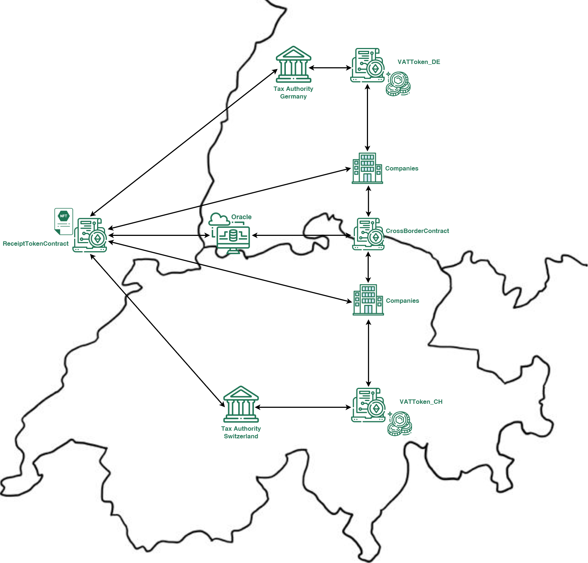

# Enhancing Tax Compliance: Exploring the Potential of Smart Contracts regarding VAT Fraud and Efficiency

## Description
The Tokenization Team is developing a prototype for a smart contract solution for the Value-Added-Tax (VAT) system in Switzerland and the border to Germany. The objective of this prototype is to prevent VAT fraud, enhance system efficiency, transparency and security, and thus aid the government in ensuring their compliance and to safeguard revenue.
Similar to Ainsworth et al. (2016), the team proposed incorporating a VATToken (ERC20 Token) into their smart contracts solution for VAT payments. Moreover, a ReceiptToken (ERC721) can be generated after a successful VAT payment to the government, which provides an unfalsifiable proof of the transaction for both buyers and sellers of goods or services. In cross-border transactions, the CrossBorderContract is required to be able to transfer goods.

 

### 1.	Companies  
Companies are the primary focus of the prototype. They can be centrally registered in the ReceiptTokenContract and interact with this contract as well as with the VATToken_CH and VATToken_De contract. The companies can have locations in Switzerland and Germany.

### 2.	Tax Authorities  
These represent the governmental tax entities for each country. They receive information from the ReceiptToken and VATToken contracts, which include transaction data relevant for tax collection, regulation and auditing. The tax authorities grant a token credit when they receive a fiat payment.

### 3.	ReceiptTokenContract  
This contract is the centerpiece of the smart contract solution. It keeps track of the regis-tered companies, and its central function is to create for every transaction a Receipt Token for the buyer as well as the seller. This system is particularly valuable for tracking and au-diting purposes for presenting the receipt to the tax authority and transporting the goods across the border in a transparent and legal manner. The tokens of the seller and buyer are linked, thus capturing the entire supply chain. The contract uses the oracle contract to cal-culate the VAT amounts payable according to the current VAT rates.

### 4.	VATToken Contracts  
The VATToken contracts are used to simplify the VAT payments and refunds using either the VAT_CH or the VAT_DE token to reduce the potential of fraud and streamline tax administration. The VAT payment in these contracts is also the basis to be able to create a Receipt Token in the ReceiptTokenContract. For accuracy in the calculation the contract accesses the VAT rates from the Oracle for refunds.

### 5.	Oracle Contract  
The oracle contract simulates a real blockchain oracle by setting the VAT rates and ex-change rate for the two countries. These rates can only be changed by government entities.

### 6.	CrossBorderContract  
This contract plays a crucial role in managing cross-border transactions within the VAT system. The primary goal is to simplify the complex tax implications of cross-border commerce, ensuring compliance with different VAT rates and regulations. This contract is essential for reducing administrative burdens, mitigating VAT fraud, and fostering a more transparent international trade environment. The contract automatically calculates the VAT difference of Switzerland and Germany by calling the oracle for the VAT rates and either pays (Switzerland to Germany) the difference from the companies account or refunds (Germany to Switzerland) the difference to the companies account. 

## Background
The need to change the VAT system arises from its inherent inefficiencies and susceptibility to fraud, as its all-phase taxation structure leads to complex calculations and creates opportunities for a range of fraudulent activities. Moreover, in Switzerland, common evasion methods like missing trader fraud, smuggling, undervaluation, and misuse of tax rates, as reported by the Bundesamt für Zoll und Grenzsicherheit (BAZG), highlight the persistent challenges in VAT administration, underscoring the urgency for systemic reform.

## Smart Contracts
### [ReceiptTokenContract](VAT%20Fraud/ReceiptTokenContract.sol)
- **Purpose**:
    The ReceiptTokenContract is an ERC721 contract integral to our blockchain-based VAT system, designed to tokenize buying and selling transactions. It aims to ensure transparent and immutable transaction records, significantly reducing VAT fraud potential. This contract is crucial in digitizing receipts and VAT records, ensuring each transaction is accurately and securely documented on the blockchain, including details about goods or services. It is invaluable for tracking and auditing, providing a reliable and efficient means of managing VAT-related information. It allows owners to present receipts to tax authorities and transport goods across borders transparently and legally.
- **Features**:
  - **Ownership and Permissions**: Utilizes Ownable and therefore only one central authority of Switzerland and Germany can perform critical operations.
  - **Tokenization of Transactions**: Issues ERC721 tokens (NFTs) to represent individual transactions, ensuring a unique and tamper-proof record of each sale and purchase.
  - **Seller and Buyer Tokens**: Differentiates between tokens issued to sellers and buyers, encapsulating the details of each party's involvement in the transaction.
  - **Twin-Token ID**: The contract incorporates a unique twin-token ID mechanism to link the buyer and seller token.
  - **Receipt and Company Structs**: Defines structured data for receipt tokens and registered companies, encompassing essential transaction and entity details.
  - **VAT Calculation and Recording**: Calculates VAT based on transaction values and stores this information within each token, streamlining the tax recording process.
  - **Enhanced Transparency in Supply Chains**: Tracks and records the usage of products to produce further processed goods in supply chains, contributing to greater transparency and accountability.
  - **Secure Company Registration and Management**: Manages the registration of companies, ensuring that only authorized entities can create receipt tokens.
  - **Cross-Border Functionality**: Coordinates with the CrossBorderContract for international transactions, handling different VAT rates and regulations.
  - **VATToken Functionality**: Interacts with VATToken_DE and VATToken_CH for specific regional VAT handling, and integrates with an Oracle contract for dynamic VAT rate and currency information.
  - **Used Product Tracking**: Records the percentage of used products in further processed goods, aiding in VAT refund claims and supply chain management and transparency.
  - **Events for Token Creation and Chain End**: Emits events for new token creation and signaling the end of a supply chain, adding to the system's  traceability.

### [VATTokenContract Switzerland](VAT%20Fraud/VATToken_CH.sol)
- **Purpose**:
    The VATTokenContract for Switzerland is an ERC20 (ERC20Burnable and ERC20Permit) token contract, forming an essential part of the blockchain-based VAT system. It is specifically designed for handling VAT transactions in Switzerland, ensuring seamless and secure VAT processing. The VAT payment in this contract is the basis to be able to create a receipt token. The contract's primary role is to facilitate the issuance, transfer, and management of VAT tokens, representing VAT amounts in digital form. This contract serves as a digital ledger for VAT transactions, making VAT management more efficient and transparent, particularly for cross-border transactions. Therefore the contract streamlines VAT payments and refunds and fraud scenarios in complex tax calculation scenarios and input tax deduction can be prevented.
- **Features**:
  - **Ownership and Permissions**: Utilizes Ownable and custom modifiers to ensure that only authorized entities (Swiss tax authority) can perform critical operations.
  - **Tokenization of VAT**: The contract creates a digital representation of VAT credit given by the government after a fiat transaction is made, allowing for seamless and transparent tracking of VAT payments and obligations.
  - **ERC20 Compliance**: Adheres to the ERC20 standard, ensuring compatibility with a wide range of wallets and services in the Ethereum ecosystem.
  - **Tax Payment and Refund Mechanism**: Facilitates VAT payments from businesses to the government and manages tax refunds, ensuring accurate, fast and transparent transactions with the use of the VAT rates of the Oracle.
  - **Governmental Oversight**: Empowers government entities, such as tax authority, to mint, distribute, and manage VAT tokens, ensuring regulatory compliance.
  - **Transfer Restrictions**: Implements rules to prevent unauthorized or non-compliant transfer of tokens, reinforcing the integrity of the VAT process.
  - **Buy and Sell Functionality**: Enables businesses to buy VAT tokens against their token credit and sell them back to the government, facilitating liquidity in the VAT ecosystem.
  - **Token Purchase and Redemption**: Allows companies to buy VAT tokens using their token credit and sell VAT tokens back to the government, enhancing liquidity and flexibility in VAT management.
  - **Event Logging**: The VATTokenContract for Germany incorporates event logging as a crucial feature to provide transparency and traceability in its operations. This feature is essential for auditing, regulatory compliance, and maintaining the integrity of the VAT system.
  - **Receipt Token Integration**: Integrates with the ReceiptTokenContract to access detailed transaction data of the ReceiptTokens for accurate VAT calculation and refund processing.
  - **Cross-Border Considerations**: Works with the CrossBorderContract for managing VAT in cross-border transactions, addressing VAT complexities between Switzerland and Germany.
  - **VATTokenContract Collaboration**: Works in conjunction with the VATTokenContract of Germany

### [VATTokenContract Germany](VAT%20Fraud/VATToken_DE.sol)
- **Purpose**:
    The VATTokenContract for Germany, an ERC20 (ERC20Burnable and ERC20Permit) token contract, is a crucial part of the blockchain-based VAT system, tailored for VAT transactions in Germany. Its design ensures seamless VAT processing within the German context. It operates exactly the same as the VATTokenContract of Switzerland.
- **Features**:
  - **Ownership and Permissions**: Uses Ownable and custom modifiers, ensuring operations are conducted only by authorized entities
(German tax authority).
  - **Tokenization of VAT**: Digitally represents VAT credit from the government, facilitating transparent tracking and management of VAT payments.
  - **ERC20 Compliance**: Follows the ERC20 standard for compatibility across the Ethereum ecosystem.
  - **Tax Payment and Refund Mechanism**: Facilitates VAT payments from businesses to the government and manages tax refunds, ensuring accurate, fast and transparent transactions with the use of the VAT rates of the Oracle.
  - **Governmental Oversight**: Enables government entities to mint, distribute, and manage VAT tokens, adhering to regulatory requirements.
  - **Transfer Restrictions**: Incorporates rules to prevent unauthorized token transfers, maintaining the VAT process's integrity.
  - **Buy and Sell Functionality**: Permits businesses to purchase VAT tokens against their token credit and sell them back to the government, enhancing liquidity.
  - **Token Purchase and Redemption**: Allows companies to buy VAT tokens using their token credit and sell VAT tokens back to the government, enhancing liquidity and flexibility in VAT management.
  - **Event Logging**: The VATTokenContract for Germany incorporates event logging as a crucial feature to provide transparency and traceability in its operations. This feature is essential for auditing, regulatory compliance, and maintaining the integrity of the VAT system.
  - **Receipt Token Integration**: Collaborates with the ReceiptTokenContract to utilize transaction data for precise VAT calculation and refunds.
  - **Cross-Border Considerations**: Works with the CrossBorderContract for managing VAT in cross-border transactions, addressing VAT complexities between Germany and Switzerland.
  - **VATTokenContract Collaboration**: Interacts with the VATTokenContract of Switzerland for cohesive VAT management across the two countries.

### [CrossBorderContract](VAT%20Fraud/CrossBorderContract.sol)
- **Purpose**:
    The CrossBorderContract plays a crucial role in managing cross-border transactions within the VAT system. It is designed to automate and streamline the VAT adjustments for products and services that cross borders. The primary goal is to simplify the complex tax implications of cross-border commerce, ensuring compliance with different VAT rates and regulations. This contract is essential for reducing administrative burdens, mitigating VAT fraud, and fostering a more transparent international trade environment.
- **Features**:
  - **Multi-Government Accessibility**: Designed to be operated by multiple government entities (Switzerland & Germany, reflecting the collaborative nature of international trade.
  - **Automated VAT Adjustment**: Calculates and settles tax differences based on varying VAT rates of countries involved in the transaction.
  - **Ownership Verification**: Ensures that the caller of the function is the rightful owner of the token representing the product being exported.
  - **Legal Export Check**: Verifies that the product can be legally exported and imported, adhering to international trade regulations.
  - **VAT Rate Management**: Uses an Oracle allowing for dynamic tax calculations.
  - **Forbidden Goods Handling**: Manages a list of goods that are forbidden from export or import, enhancing regulatory compliance.
  - **Cross-Border Tax Settlements**: Adjusts VAT payments in accordance with the destination country's tax rate using the data of the Oracle, handling both tax credits and additional tax requirements.
  - **Event Logging for Cross-Border Movements**: Records details of items crossing borders, including origin, destination, and token ID, for transparency and tracking.
  - **Integration with VATToken and ReceiptTokenContract**: Works in conjunction with VATTokenContract for tax payments and ReceiptTokenContract for validating transaction details.

### [Oracle ](VAT%20Fraud/Oracle.sol)
- **Purpose**:
    The Oracle contract serves as a crucial component in the blockchain-based VAT system, providing reliable and up-to-date financial data to other contracts. It functions as a trusted source for VAT rates and exchange rates. The primary role of this contract is to ensure that all VAT calculations and financial transactions within the system are based on accurate and current financial data, thereby ensuring compliance and consistency in VAT processing across different countries.
- **Features**:
  - **Ownership and Permissions**: Utilizes Ownable and therefore only one central authority of Switzerland and Germany can perform the setting of the rates in this contract.
  - **VAT Rate Management**: Manages and stores the VAT rates for different countries, allowing for dynamic and accurate VAT calculations in cross-border transactions.
  - **Currency Information Storage**: Keeps track of the official currencies used by different countries, ensuring that all financial transactions are processed in the correct currency.
  - **Exchange Rate Provision**: Manages and stores the exchange rate between CHF and EUR, vital for transactions involving Switzerland and Germany. This feature is critical for accurately converting VAT amounts between different currencies.
  - **Owner-Controlled Updates**: Designed to allow only the contract owner (a trusted third party) to update VAT rates, currencies, and exchange rates, maintaining the integrity and reliability of the data.
  - **Data Deletion Functionality**: Provides the contract owner with the ability to delete outdated or incorrect VAT rates and currency information, ensuring the system's data remains current and accurate.

## Contributors
- <a href="https://github.com/darioganz" style="text-decoration: none; color: black;">Dario Ganz</a>
- <a href="https://github.com/SamuelClauss" style="text-decoration: none; color: black;">Samuel Clauss</a>

